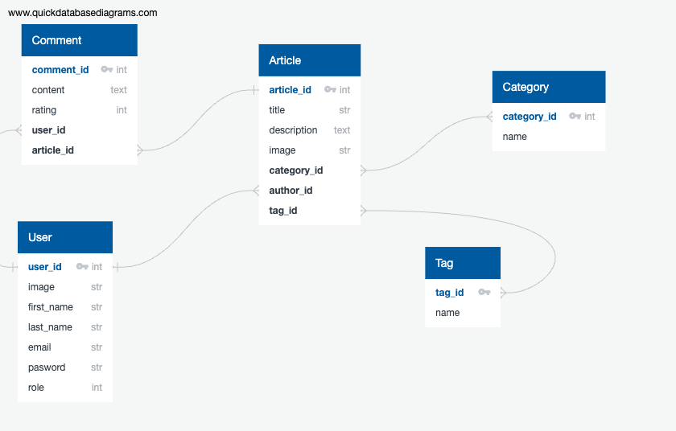

# Final API Project - Index Internship

This API is built with Ruby on Rails and is using PostgreSQL database.
Here we have the relationship diagram of the database:

## Getting Started
Follow these steps to set up and run the API:

1. Clone this repository to your local machine.

2. In the `.env` file put all your environment variables from PostgreSQL.

3. Run following commands to build and run the API:
    
```bash
docker-compose build
docker-compose up -d
```

4. Run the following commands to create, migrate and seed the database:

```bash
docker-compose exec app rails db:create
docker-compose exec app rails db:migrate
docker-compose exec app rails db:seed
```

5. Open `http://localhost:3000/api-docs/index.html` in your browser to see the API Swagger documentation, or you can test the API endpoints that are available in the `Endpoints` folder.